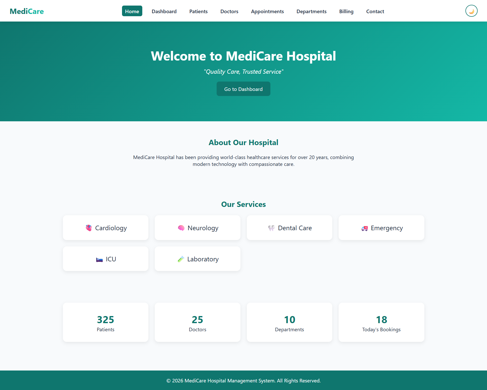
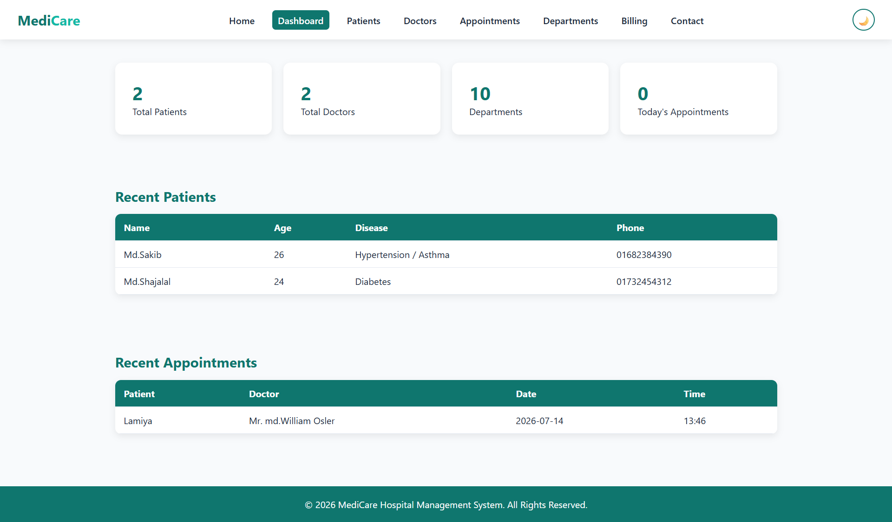
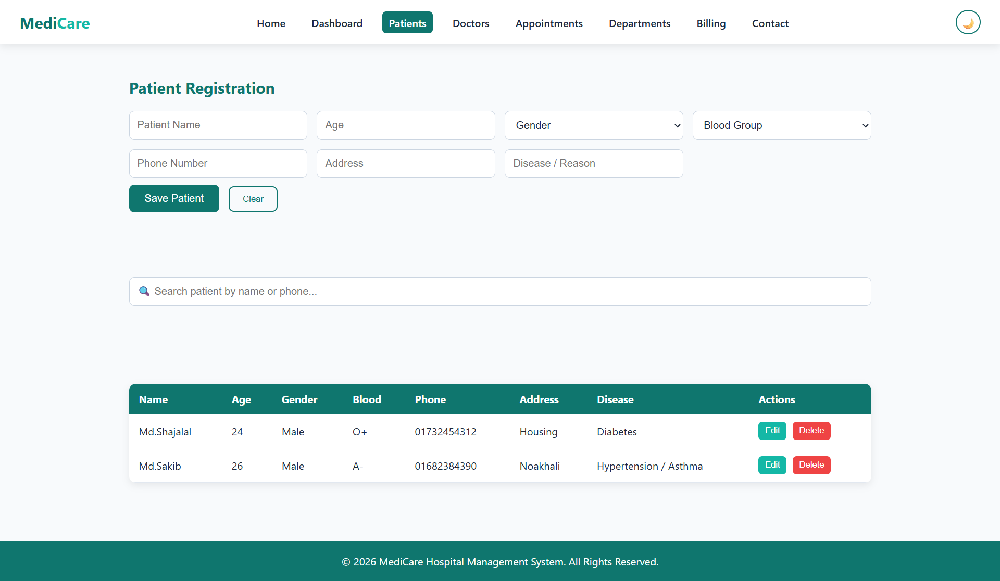
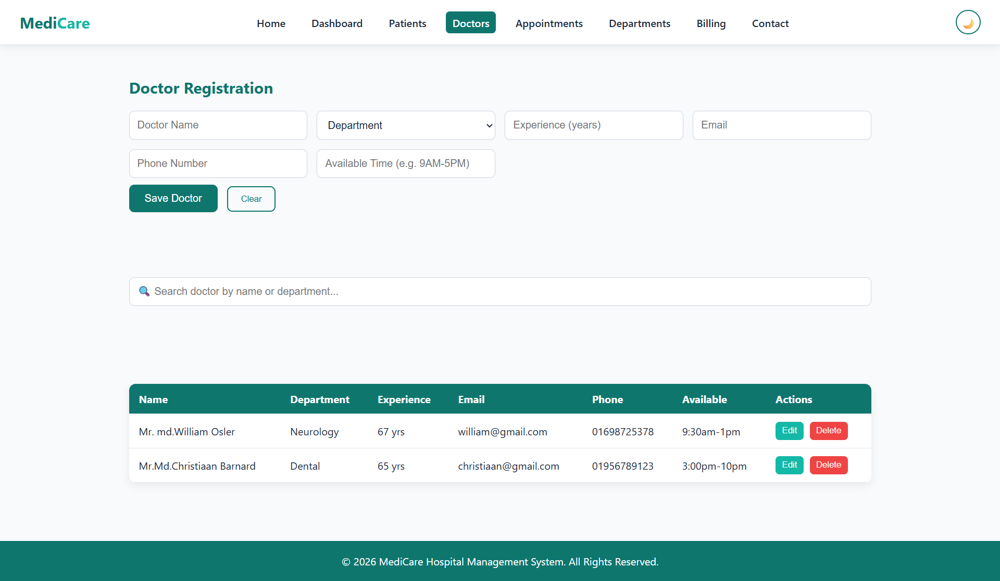
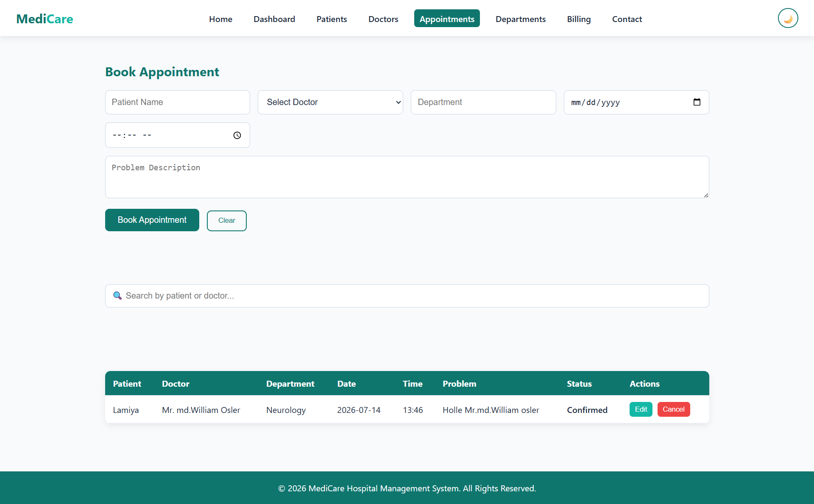
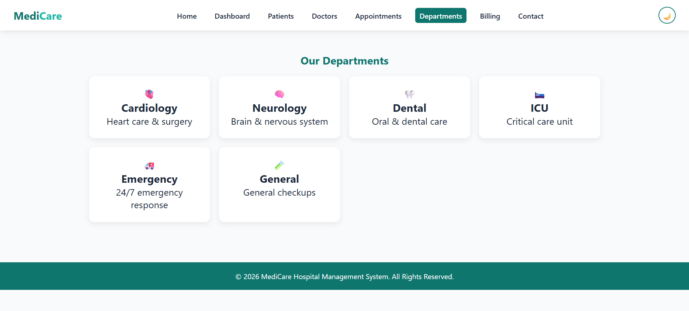
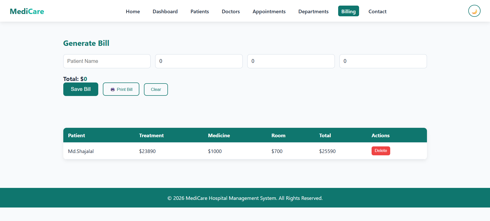
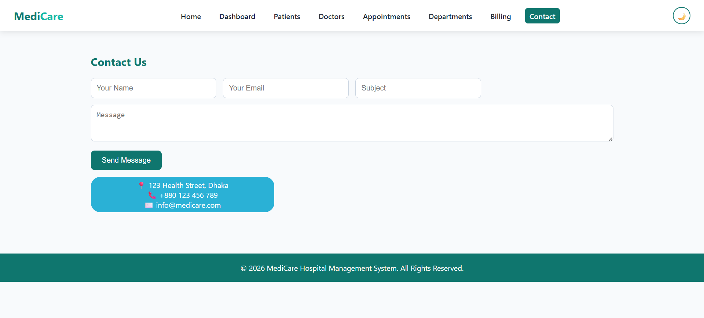

# 🏥 MediCare Hospital Management System

A modern, responsive Hospital Management System built using **HTML**, **CSS**, and **JavaScript**.

---

# 📸 Project Preview

## 🏠 Home Page

<p align="center">
  
</p>

---

## 📊 Dashboard

<p align="center">
  
</p>

---

## 👨 Patients

<p align="center">
  
</p>

---

## 👨‍⚕️ Doctors

<p align="center">
  
</p>

---

## 📅 Appointments

<p align="center">
  
</p>

---

## 💊 Pharmacy

<p align="center">
  
</p>

---

 

## 💰 Billing

<p align="center">
  
</p>

---

## 📞 Contact

<p align="center">
  
</p>

---

# 🚀 Technologies Used

- HTML5
- CSS3
- JavaScript (ES6)
- Local Storage
- Font Awesome
- Google Fonts

---

# 📂 Folder Structure

```text
hospital-management/
│
├── index.html
├── dashboard.html
├── patients.html
├── doctors.html
├── appointments.html
├── departments.html
├── pharmacy.html
├── laboratory.html
├── billing.html
├── reports.html
├── contact.html
│
├── css/
├── js/
├── images/
└── README.md
```

---

# ✨ Features

- Responsive Design
- Dashboard
- Patient Management
- Doctor Management
- Appointment Booking
- Department Management
- Pharmacy
- Laboratory
- Billing System
- Reports
- Dark/Light Mode
- Local Storage

---
### 🌟 Benefits

- Simplifies hospital management through an organized dashboard.
- Improves efficiency in managing patients, doctors, and appointments.
- Provides a clean and responsive interface for all devices.
- Demonstrates CRUD operations using JavaScript and Local Storage.
- Enhances frontend development skills with real-world project experience.
- Serves as an excellent academic project and portfolio showcase.
- Easy to customize and extend with backend technologies in the future.

---

# 👨‍💻 Author

**Md. Shajalal**
## Department of 
- Computer Science Engineering

---

# ⭐ If you like this project

Give it a ⭐ on GitHub!
[](https://app.netlify.com/projects/hospital-management-system088/deploys)