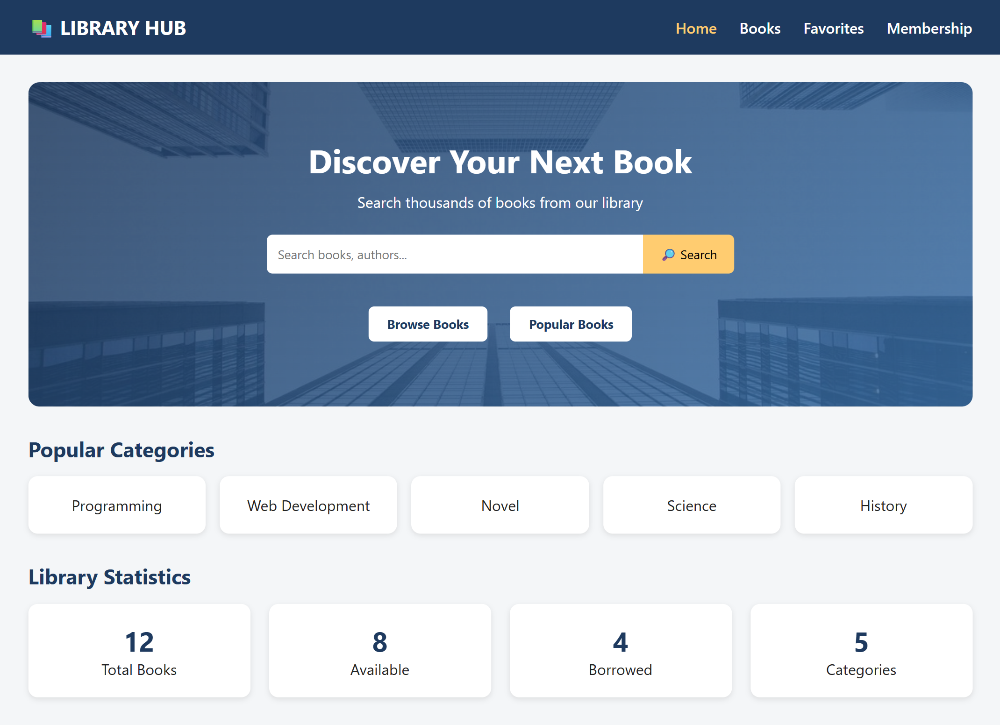
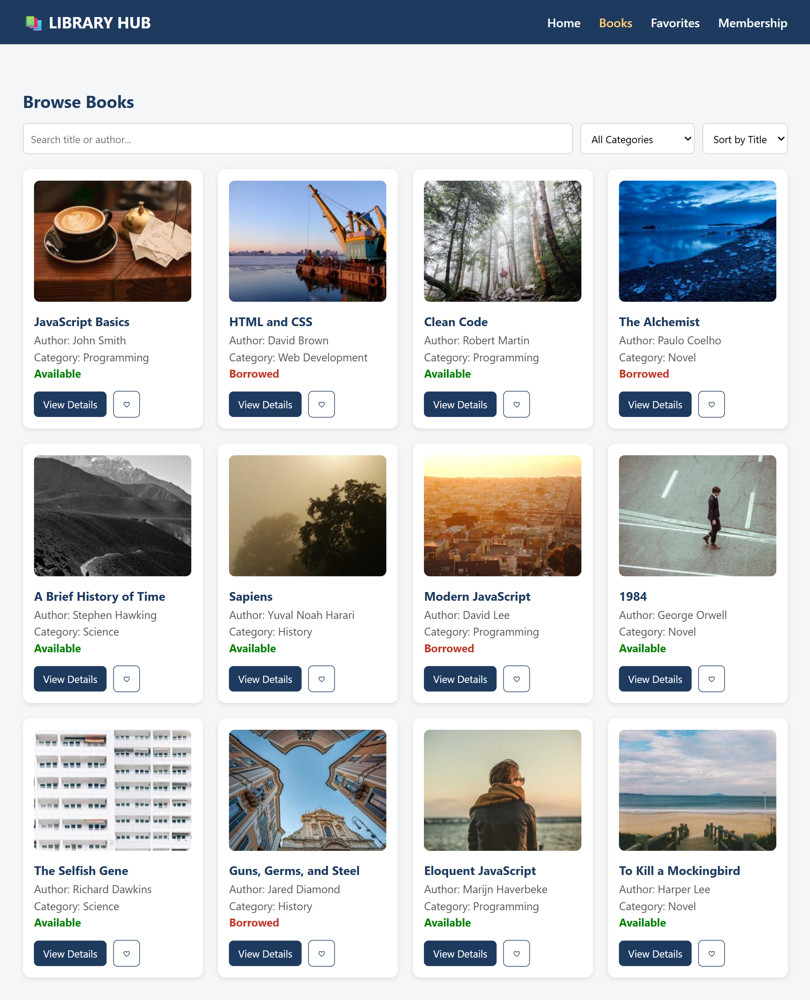
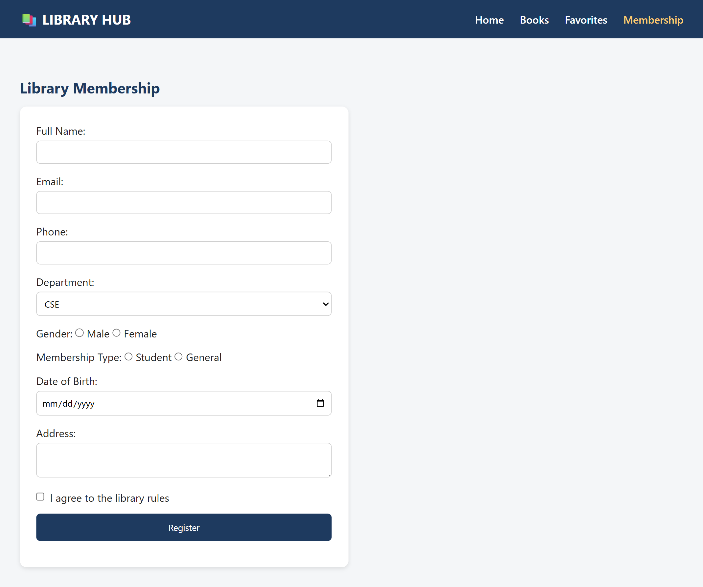

# 📚 Online Library

> A modern and interactive Online Library & Book Search System built with HTML, CSS, JavaScript, DOM, JSON, and AJAX.

---

## 🌐 Project Overview

**Online Library** is a web-based book discovery and search system that allows users to browse, search, filter, and explore books through a clean and responsive interface.

The project uses **AJAX and JSON** to load book information dynamically without reloading the webpage.

The main goal of this project is to demonstrate practical implementation of:

- HTML
- CSS
- JavaScript
- DOM Manipulation
- HTML Forms
- JSON
- AJAX
- Client-Server Interaction
- Responsive Web Design

---
## 📸 Project Preview







---

## ✨ Features

### 🔍 Book Search
Search books by:

- Book title
- Author
- Category
- Keywords

### 📚 Browse Books

Users can browse all available books through attractive book cards.

### 🏷️ Category Filter

Books can be filtered by categories such as:

- Programming
- Web Development
- Science
- History
- Novel
- Mathematics

### 📖 Book Details

Users can view detailed information about a selected book.

Information includes:

- Book title
- Author
- Category
- Publication year
- ISBN
- Availability
- Description

### ❤️ Favorites

Users can add interesting books to their favorite list.

### 📝 Membership Form

A library membership form allows users to enter:

- Full Name
- Email
- Phone
- Department
- Gender
- Membership Type
- Date of Birth
- Address

### ✅ Form Validation

JavaScript validates the user input before submission.

### 🔄 AJAX Data Loading

Book information is loaded dynamically from a JSON file using AJAX.

The webpage does not need to reload when book data is requested.

### 📱 Responsive Design

The interface is designed to work on:

- Desktop
- Laptop
- Tablet
- Mobile

---

# 🛠️ Technologies Used

| Technology | Purpose |
|------------|---------|
| HTML5 | Website structure |
| CSS3 | Styling and responsive layout |
| JavaScript | Application logic |
| DOM | Dynamic webpage manipulation |
| JSON | Book data storage |
| AJAX | Asynchronous data loading |

---

# 🔄 Project Workflow

```text
                  USER
                    │
                    ▼
             Search / Filter
                    │
                    ▼
               JavaScript
                    │
                    ▼
               AJAX Request
                    │
                    ▼
                books.json
                    │
                    ▼
               JSON Response
                    │
                    ▼
             JSON.parse()
                    │
                    ▼
             Filter / Process
                    │
                    ▼
              DOM Manipulation
                    │
                    ▼
             Display Book Cards